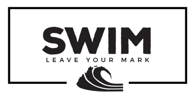

Personal Knowledge Management for the Masses

## Local Setup

`bundle`

`ruby swim.rb`

[localhost:4567](http://localhost:4567/)

## Search Setup

Get a [Bing API key](https://www.microsoft.com/cognitive-services/en-us/bing-web-search-api).

Add to `BING_KEY` in `swim.js`.
